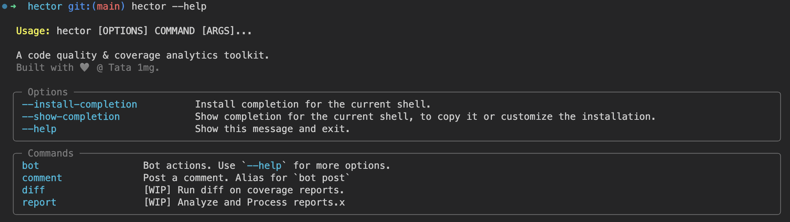

# Hector 

A code quality & coverage analytics toolkit.

Built with 🤍 @ Tata 1mg

✨ FOSS, self hosted, self managed alternative to `codecov`, `codeclimate`, `codefactor` & similar services.

- Lightweight, stateless CI pipeline integration
- PR comments with coverage & code health reports

## Installation

```py
pip install git+https://github.com/tata1mg/hector.git
```

## Usage

```py
hector --help
```



```py
# 1. Run you tests
# 2. Generate coverage report (coverage.json)
```

```py
hector diff # WIP
```

```py
hector comment --bitbucket
```

## Roadmap

### 👩🏼‍💻 Core

- [ ]  Add cli commands for all operations, using `Typer`
- [ ]  Use `Pydantic` models for parsing reports
- [ ]  Use `httpx` for http clients
- [ ]  Refactor for dependency inversion

### ✨ Features

- [ ] Bundle `diff-cover`
- [ ] Add support for Code health metrics
- [ ] Bundle `radon`

### 👾 Bots

- [x] Bitbucket PR comments
- [ ] Github PR comments
- [ ] `Flock` reports
- [ ] `Discord` reports
- [ ] `Slack` reports

### 🔧 Integrations

- [ ] Bitbucket Pipe
- [ ] Github Actions
- [ ] Github App

### 🚀 Deployment

- [ ] Support serving a `Sanic` application
- [ ] Support serving a `FastAPI` application
- [ ] Support deployment as an `AWS Lambda`

---

## Contributing

Contributions are always welcome!

Please read our [`contribution guidelines`](./CHANGELOG.md) and [`code of conduct`](./CODE_OF_CONDUCT.md) to get started.


## License

[MIT](https://choosealicense.com/licenses/mit/)
